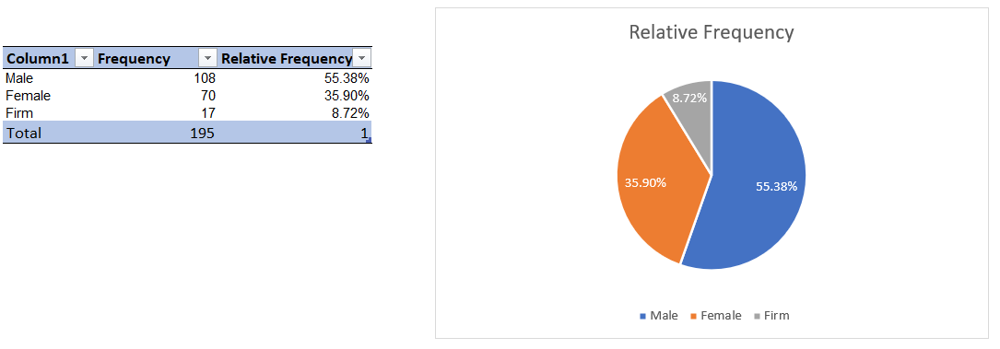
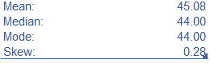
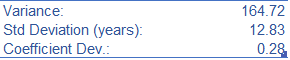
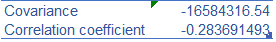
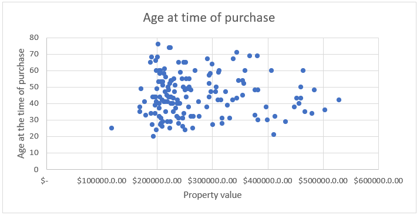

# descriptive-statistics-basics
Descriptive Statistics basics using the Real State California Database

## Objective
The organization wants to launch a marketing campaign targeting a specific audience. The department believes that after a brief analysis, marketing can be improved without investing additional resources.

## Example of the database

## Task 1
### Describing some data types

| Variable   | Type of Data  | Level of Measurement |
|------------|---------------|----------------------|
| CustId     | Categorical   | Nominal              |
| Mortage    | Categorical   | Nominal              |
| Year of sale | Numerical: discrete | Interval        |

## Task 2
### Frequency distribution

This information is biased, as the people who are included in the database is, usually, the one who signed the contract.

A possible scenario would be to invest in the top 80% of the locations. 

### Variability

The Standard deviation is around 13 years, showing how disperse the data is.

The correlation coefficient is very low, showing these two variables move in opposite directions, hence, they do not have a relationship whatsoever.

